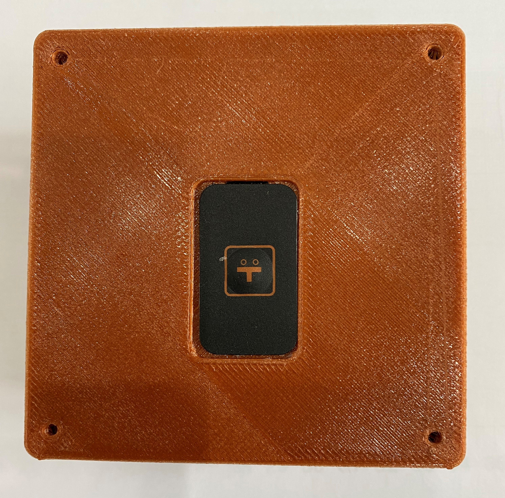

# PCB und Gehäuse für HM-LC-Sw1-FM

## Bilder

## Schaltplan

[:arrow_right: Schaltplan](Images/HM-LC-Sw1-FM_Schaltplan.pdf)

## Platine

[:arrow_right: PCB Gerber](Platine/HM-LC-Sw1-FM_V2.zip)

## Gehäuse

 

 

 

 

 

 

 

 

## Aufbau / Stückliste

### Der Aufbau

fertig bestückte Platine  

fertig bestückte Platine  

### Die benötigten Bauteile
| Bauteil | Link |
| --------|------|
| | |

## Hinweise

- :exclamation:

## Lizenz

**Creative Commons BY-NC-SA** 
Give Credit, NonCommercial, ShareAlike

 This work is licensed under a <a rel="license" href="http://creativecommons.org/licenses/by-nc-sa/4.0/">Creative Commons Attribution-NonCommercial-ShareAlike 4.0 International License</a>.
